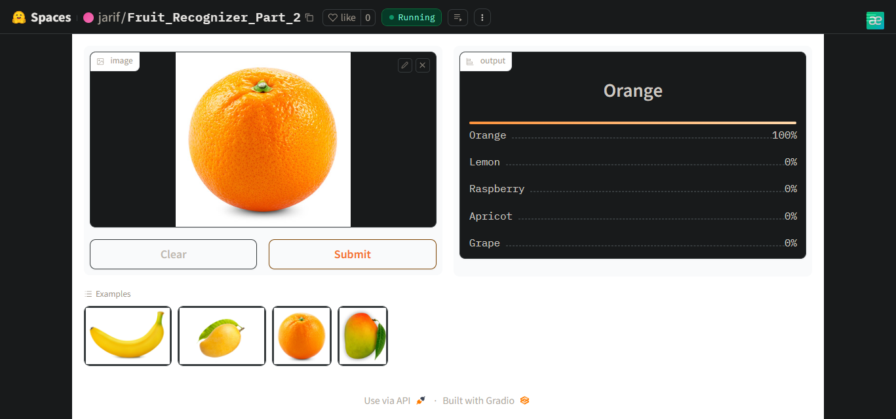

# Fruit-Recognizer
An image classification model from data collection, cleaning, model training, deployment and API integration.  
The model can classify 20 different types of fruits.  
The types are following:  

* Apple
* Grape
* Kiwi
* Orange
* Pineapple
* Papaya
* Watermelon
* Lemon
* Avocado
* Raspberry
* Lychee
* Pear
* Carambola
* Mango
* Banana
* Cherry
* Strawberry
* Fig
* Blueberry
* Apricot

# Dataset Preparation
**Data Collection:** Downloaded from DuckDuckGo using term name  
**DataLoader:** Used fastai DataBlock API to set up the DataLoader.  
**Data Augmentation:** fastai provides default data augmentation which operates in GPU.  
Details can be found in `Notebooks/Fruit_Recognizer.ipynb`

# Training and Data Cleaning
**Training:** Fine-tuned a resnet50 model for 5 epochs (3 times) and got upto ~84% accuracy.  
**Data Cleaning:** This part took the highest time. Since I collected data from browser, there were many noises. Also, there were images that contained. I cleaned and updated data using fastai ImageClassifierCleaner. I cleaned the data each time after training or finetuning, except for the last time which was the final iteration of the model.  

# Model Deployment
I deployed to model to HuggingFace Spaces Gradio App. The implementation can be found in `Deployment` folder or [here](https://huggingface.co/spaces/jarif/Fruit_Recognizer_Part_2).  

# API integration with GitHub Pages
The deployed model API is integrated [here](https://jarif87.github.io/Fruit-Recognizer/) in GitHub Pages Website. Implementation and other details can be found in `Docs` folder.
